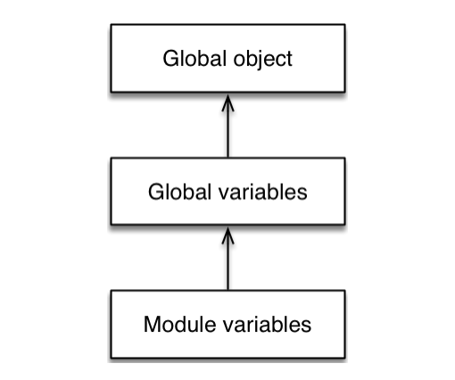

# CH 1. 블록변수와 블록스코프 및 함수

## 1-2. 블록스코프 및 함수

### 1-2-1. let과 const를 통한 블록 스코프(Block scoping via let and const)
>Block scoping means that you can shadow variables within a function.

>블록 스코프는 함수 안에 있는 변수들에게 영향을 줄 수 있는 것을 의미한다.

```js
function func() {
  const a1 = 5;
  if (true) {
     const a1 = 10; //if문 안에서 접근 가능한 변수 a
     console.log(a1); // 10
  }
  console.log(a1); // 5
}
```
```js
function func2() {
  const a2 = 5;
  if (true) {
     console.log(a2); // 5
  }
  console.log(a2); // 5
}
```
```js
const a2 = 5; //전역에 선언한 변수 a
if (true) {
   const a2 = 10;
   console.log(a2); // 10
}
console.log(a2); // 5
```

```js
var a3 = 5;
const b1 = 10;

if (true) {
   console.log(a3); // (1)
   console.log(b1); // (2)
}
console.log(a3); // (3)
console.log(b1); // (4)
```
결론 : 문 안에서 `let`이나 `const`와 같은 키워드를 선언을 하지 않을 경우에는 Scope Chaining에 의해 상위 스코프의 영향을 받는 다는 것을 알 수 있다.

### 1-2-2. 변수 선언의 생명주기로 발생하는 TDZ
```js
//example 01
let test = console.log(test); //ReferenceError: test is not defined

//ex 02-01
if (true) { // 새로운 스코프, TDZ 시작!
    const func = function () {
        console.log(testVar); // OK!
    };

    console.log(testVar); //(1)
    // Here we are within the TDZ and
    // accessing `testVar` would cause a `ReferenceError`

    let testVar = 3; // TDZ 끝
    func(); // called outside TDZ (2)
}
```
```js
//ex 02-01
if (true) { // 새로운 스코프, TDZ 시작!
    const func = function () {
        console.log(testVar); // OK!
    };

    let testVar = 3; // TDZ 끝
    func(); // called outside TDZ (1)

    console.log(testVar); //(2)
}
```

### 1-2-3. 전역객체
이전에는 전역에 선언할 수 있던 객체는 `var`와 함수였다. 하지만 ES6에서부터는 전역에 `let`과 `const`, `Class`를 선언할 수 있게 되었다.

```
전역에 선언할 수 있는 것들
- var
- 함수
- let      (ES6 추가)
- const    (ES6 추가)
- Class    (ES6 추가)
```


>Note that the bodies of modules are not executed in global scope, only scripts are. Therefore, the environments for various variables form the following chain.


### 1-2-4. 그럼에도 불구하고, `var`만 할 수 있는게 있다?
> Coding style: const versus let versus var
> I recommend to always use either let or const:
> 3. Avoid var.
> If you follow these rules, var will only appear in legacy code, as a signal that careful refactoring is required.
>
>var does one thing that let and const don’t: variables declared via it become properties of the global object. However, that’s generally not a good thing. You can achieve the same effect by assigning to window (in browsers) or global (in Node.js).

위 인용문은 ['Exploring ES6'](http://exploringjs.com/es6/ch_variables.html)에 나와있는 키워드 `let`과 `const` 그리고 `var`의 코딩 스타일을 비교한 글 중 일부다.
저자는 `var`를 무조건 피하고, 항상 `let`과 `const` 만을 쓸 것을 당부한다. 개발자가 이러한 법칙을 따르다 레거시(기존의) 코드 안에서 `var`를 발견할 때에는 소스 리팩토링을 요구하는 신호라고 까지 말할 정도이다.
하지만 `let`과 `const`를 쓸 것을 당부를 하는 이유는 아래와 같다. `var`는 `let`과 `const`와 다르게 유일하게 할 수 있는 것이 바로 전역 객체의 프로퍼티를 통해 선언하는 것이다.
 ```js
 var a = 10;
 let b = 20;

 console.log(a, b);               // (1) 10, 20
 console.log(window.a, window.b); // (2) 10, undefined
 console.log(this.a, this.b);     // (3) 10, undefined
 ```
 이 예제는 `var`가 전역에서 선언이 될 때 window 객체에 할당 됨을 보여주는 예이다. 실행 결과를 보면 `let`으로 선언한 변수 b의 경우는 전역에 선언했지만 window 객체에는 할당하지 않기 때문에 `undefined`라는 결과가 나온다. 그리고 전역 공간에서의 `this`는 window를 가르키기 때문에 마찬가지로 this.b 는 window.b와 같으므로 undefined를 나타낸다.

 결국 window.a와 같은 값의 경우엔 `var`를 통해 개발자가 값을 직접 할당 하도록 유도하는 것이라 볼 수 있다. 따라서 ES6에서 새로 추가된 키워드 `let`과 `const`의 사용을 함으로써 변수의 전역 선언 시의 애매모호했던 스코프의 개념을 바로 잡는 데 의미가 있다.

### 1-2-5. 함수의 호이스팅과 use strict
```js
//example 01
{
  foo();                               // (R1)
  function foo(){ console.log(1); }    // (D1)
  {
    foo();                             // (R2)
    function foo(){ console.log(2);}   // (D2)
  }
}
foo();                                 // (R3)
```

```js
//example 02-01
foo();                                 // (R1)
{
  function foo(){ console.log(1); }    // (D1)
  {
    function foo(){ console.log(2);}   // (D2)
    foo();                             // (R2)
  }
  foo();                               // (R3)
}
foo();                                 // (R4)
function foo(){ console.log(3); }      // (D3)
```

```js
//example 02-02
'use strict';
foo();                                 // (R1)
{
  function foo(){ console.log(1); }    // (D1)
  {
    function foo(){ console.log(2);}   // (D2)
    foo();                             // (R2)
  }
  foo();                               // (R3)
}
foo();                                 // (R4)
function foo(){ console.log(3); }      // (D3)
```
example 01, example 02-01 은 브라우저 마다 다른 결과 값이 나온다.
크롬(버전 : 55.0.2883.95 기준), 파이어폭스(버전 : 50.1.0 기준) 역시 서로 다른 결과 값이 출력된다. (IE의 경우는 ES6 해석을 할 수 없으므로 제외)
이는 브라우저 마다 각각의 블록 스코프의 해석이 다르기 때문에 발생하는 것이며, 마지막 예제와 같이 example 02-02 에서 처럼 'use strict' 모드로 했을 때에는 모든 브라우저 결과가 동일함을 볼 수 있다. 현 시점(2017. 01. 21)에서는 파이어 폭스가 'use strict'를 자동으로 지원을 해주기 때문에 ES6를 테스트 할 때에는 개인적으로 파이어 폭스를 추천한다.
