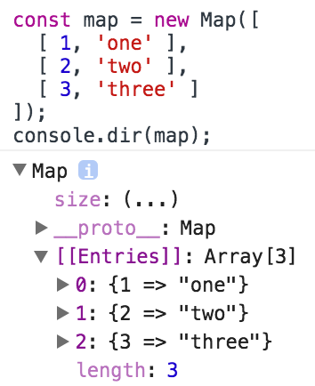

# 6-1. Map

> Map 객체는 key/value를 모아놓은 콜렉션으로 키/값의 타입은 제약이 없다.

> 삽입한 순서대로 정렬되며 맵 객체는 Map 생성자로 만든다.


## 6-1-1. 기본 동작들

### 6-1-1-1. 생성자
- `new Map()`을 이용해서 map을 생성
- 이터러블한 파라미터를 제공하지 않으면 빈 맵이 생성된다.
- `[['key', 'value'], ['key', 'value']]` 형태의 collection이나 iterable을 파라미터로 제공하여 Map 생성자를 통해서 쉽게 map으로 변형할 수 있다.

```js
const map = new Map([
  [ 1, 'one' ],
  [ 2, 'two' ],
  [ 3, 'three' ], // 끝의 컴마는 무시된다.
]);
```

크롬 브라우저에서의 map 출력 결과의 모습

> 

Map의 생성자는 내부적으로 아래와 같이 동작한다. forEach를 이용해서 key/value쌍을 하나씩 map에 할당해주고 있다.

```js
let items = [
  [ 1, 'one' ],
  [ 2, 'two' ],
  [ 3, 'three' ]
]
let map = new Map();
items.forEach(([key, value]) => map.set(key, value));
```

### 6-1-1-2. 개별 엔트리에 대한 제어

#### 데이터 세팅

- `map.set(key,value)`는 map 에 지정한 키에 지정한 값을 추가한다.
  - 이미 키가 존재한다면 해당 키에 값을 업데이트하고, 존재하지 않는다면 새로운 엔트리를 생성한다 (`obj[key] = value`).
  - 이 메소드는 `this`를 리턴하므로, 메소드 체이닝이 가능하다.

```js
let map = new Map();
map.set(new Date(), function today () {});
map.set(() => 'key', { pony: 'foo' });
map.set(Symbol('items'), [1, 2]);
```

```js
const map = new Map()
.set(1, 'one')
.set(2, 'two')
.set(3, 'three');
```

- `map.get(key)`를 사용해서 해당 key와 연관된 value 를 리턴한다. 만약 그런 엔트리가 존재하지 않을 경우 `undefined`를 리턴한다. (`obj[key]` 구문처럼)
- `map.has(key)`를 사용해서 해당 key가 map에 있는지 여부를 `boolean`값으로 리턴한다.
- `map.delete(key)`를 사용해서 엔트리를 삭제한다. (`delete obj[key]` 구문처럼) 맵에 해당 키가 존재하면 이를 삭제하면서 `true`를 반환하고, 존재하지 않는다면 `false`를 반환한다.


```js
const map = new Map();
map.set('foo', 123);
map.get('foo');         // 123
map.has('foo');         // true
map.delete('foo');      // true
map.has('foo');         // false
```


#### 키
어떤 값이든 키가 될 수 있다.
```js
let map = new Map([
  [new Date(), function today () {}],
  [() => 'key', { pony: 'foo' }],
  [Symbol('items'), [1, 2]]
]);
```

동일한 key에 값을 넣으면 이전의 값을 덮어쓰게 된다.

```js
let map = new Map()
map.set('a', 'a')
map.set('a', 'b')
map.set('a', 'c')
console.log([...map])
// <- [['a', 'c']]
```


ES6 Map에서 NaN은 corner-case가 된다.
`NaN`과 `NaN`을 동등하다고 판단하지 않는데
맵의 key로 사용될 때는 동일하게 인식된다.

```js
console.log(NaN === NaN) // <- false

let map = new Map()
map.set(NaN, 'foo')
map.set(NaN, 'bar')
console.log([...map])
// <- [[NaN, 'bar']]

map.set(NaN, 123);
map.get(NaN);           // 123
```

Symbol 값은 항상 다르기 때문에 key로는 사용 할 수 없고, value로만 사용해야 한다.

```js
let map = new Map([[NaN, 1], [Symbol(), 2], ['foo', 'bar']])
console.log(map.has(NaN))
// <- true, NaN은 key로 사용 가능하다
console.log(map.has(Symbol()))
// <- false, Symbol 값은 항상 다르기 때문에 key로는 사용 할 수 없고, value로만 사용해야 한다.
console.log(map.has('foo'))
// <- true
console.log(map.has('bar'))
// <- false
```

서로 다른 객체는 언제나 다른 값으로 여긴다.

```js
const map = new Map();

const KEY1 = {};
map.set(KEY1, 'hello');
console.log(map.get(KEY1));     // hello

const KEY2 = {};
map.set(KEY2, 'world');
console.log(map.get(KEY2));     // world
```

존재하지 않는 키의 값을 얻고자 하면 undefined가 반환된다.

```js
new Map().get('asfddfsasadf')
//undefined
```

spread operator도 사용할 수 있다.

```js
let map = new Map();
map.set('p', 'o');
map.set('n', 'y');
map.set('f', 'o');
map.set('o', '!');
console.log([...map]);
// <- [['p', 'o'], ['n', 'y'], ['f', 'o'], ['o', '!']]
```


### 6-1-1-3. 엔트리들에 대한 일괄 제어
맵의 사이즈 결정 및 맵의 내용 제거

- `map.clear()`는 map 안의 모든 엔트리들을 제거한다.
- `map.size`를 사용하여 map에 있는 엔트리 갯수를 `number`로 반환한다.

```js
const map = new Map();
map.set('foo', true);
map.set('bar', false);
map.size                // 2
map.clear();
map.size                // 0
```


### 6-1-1-4. 이터레이팅과 루프 동작

#### Map의 이터레이팅
```js
const map = new Map([
    [false, 'no'],
    [true,  'yes'],
]);
```

맵은 각 요소가 삽입된 순서대로 요소들을 저장(기록)하며, 키나 값 또는 엔트리를 이터레이트할 때에도 이 순서에 따른다.


#### 키와 값에 대한 이터러블
- `map.keys()`와 `map.values()`는 각각 map의 모든 key와 value에 대한 이터러블을 반환한다.
```js
for (const key of map.keys()) {
    console.log(key);
}
// Output:
// false
// true
for (const value of map.values()) {
    console.log(value);
}
// Output:
// no
// yes
```

#### 엔트리에 대한 이터러블

- `map.entries()`는 맵의 [키, 값] 쌍(배열)에 대한 이터러블로 맵의 엔트리들을 반환한다.
```js
for (const entry of map.entries()) {
    console.log(entry[0], entry[1]);
}
// Output:
// false no
// true yes
```

- `map[Symbol.iterator]()` 구문은 map 안의 엔트리들을 순회할 수 있는 이터레이터를 리턴한다.
  - 해당 이터레이터는 엔트리 항목 각각을 `[key, value]` 배열로 표현한다.

```js
map[Symbol.iterator] === map.entries
//true
//맵 이터레이팅의 기본 방법은 entries()와 같다.
```
- `[@@iterator]()` 사용하기.
```js
var myMap = new Map();
myMap.set("0", "foo");
myMap.set(1, "bar");
myMap.set({}, "baz");

var mapIter = myMap[Symbol.iterator]();

console.log(mapIter.next().value); // ["0", "foo"]
console.log(mapIter.next().value); // [1, "bar"]
console.log(mapIter.next().value); // [Object, "baz"]
```
- for..of과 함께 `[@@iterator]()` 사용하기.
```js
var myMap = new Map();
myMap.set("0", "foo");
myMap.set(1, "bar");
myMap.set({}, "baz");

for (var v of myMap) {
  console.log(v);
}
//["0", "foo"]
//[1, "bar"]
//[Object, "baz"]
```

#### 맵의 엔트리들에 대한 루프

- `forEach()` 메소드나 `for..of` loop 를 사용하여 map의 엔트리를 순회한다.


맵의 `forEach`메소드는 다음과 같은 특징을 지닌다.
```js
Map.prototype.forEach((value, key, map) => void[, thisArg])
```

- 맵의 `forEach`메소드에 파라미터로 들어가는 콜백함수의 arguments
	- the element value
	- the element key
	- Map 객체


`Array.prototype.forEach(callback)`의 콜백과 마찬가지로
맵의 `forEach`메소드에 들어가는 콜백의 첫번째 argument가 value로 온다.
```js
let map = new Map([
    [false, 'no'],
    [true,  'yes'],
]);
map.forEach((value, key) => {
    console.log(key, value);
});
// Output:
// false no
// true yes
```
```js
let map = new Map();
map.set('p', 'o');
map.set('n', 'y');
map.set('f', 'o');
map.set('o', '!');
for (let [key, value] of map) {
  console.log(key, value)
}
```

#### 매핑 및 필터링
배열에서는 map()이나 filter()을 할 수 있지만, 맵에는 이러한 명령어가 없다. 해결법은 다음과 같다.

- 맵을 [키, 값] 쌍으로 구성된 배열로 전환한다.
- 배열에 맵 또는 필터 메소드를 적용한다.
- 결과를 다시 맵으로 변환한다.

```js
const originalMap = new Map()
.set(1, 'a')
.set(2, 'b')
.set(3, 'c');

/* 원본맵을 매핑하기 */
const mappedMap = new Map( // step 3
    [...originalMap] // step 1
    .map(([k, v]) => [k * 2, '_' + v]) // step 2
);
// Resulting Map: {2 => '_a', 4 => '_b', 6 => '_c'}


/* 원본맵을 필터링하기 */
const filteredMap = new Map( // step 3
    [...originalMap] // step 1
    .filter(([k, v]) => k < 3) // step 2
);
// Resulting Map: {1 => 'a', 2 => 'b'}
```

#### 맵의 결합
여러 맵을 하나로 결합하기 위해, 각각의 맵을 펼침 연산자를 이용해 배열로 전환하고, 이 배열을 병합한다.
그 다음, 이 결과를 다시 맵으로 전환한다.

```js
const map1 = new Map()
.set(1, 'a1')
.set(2, 'b1')
.set(3, 'c1');

const map2 = new Map()
.set(2, 'b2')
.set(3, 'c2')
.set(4, 'd2');

const combinedMap = new Map([...map1, ...map2])
[...combinedMap] // 펼침 연산자를 이용해 배열로 변환.
// [[1,"a1"],[2,"b2"],[3,"c2"],[4, "d2"]]
```

___
## 6-1-2. 활용 예제

### 6-1-2-1. 맵과 JSON 간의 상호 전환

JSON 호환 데이터를 가진 임의의 맵을 JSON으로, 혹은 JSON을 맵으로 전환
```js
function mapToJson(map) {
    return JSON.stringify([...map]);
}
function jsonToMap(jsonStr) {
    return new Map(JSON.parse(jsonStr));
}

const myMap = new Map().set(true, 7).set({foo: 3}, ['abc']);

mapToJson(myMap)
// '[[true,7],[{"foo":3},["abc"]]]'

jsonToMap('[[true,7],[{"foo":3},["abc"]]]')
// Map {true => 7, Object {foo: 3} => ['abc']}
```

#### 객체를 이용한 문자열 키로 구성된 맵의 JSON화
맵에 오직 문자열 키만 존재할 경우에는 언제나 이를 객체로 인코딩하여 JSON으로 전환할 수 있다.

다음 두 함수는 문자열 맵을 객체로, 또는 객체를 문자열 맵으로 전환한다.

```js
function strMapToObj(strMap) {
    const obj = Object.create(null);
    for (const [k,v] of strMap) {
        // `We don’t escape the key '__proto__' which can cause problems on older engines`
        // 구 엔진에서 문제가 될 수 있으므로 '__proto__'키를 건너뛰지 않았다.
        obj[k] = v;
    }
    return obj;
}
function objToStrMap(obj) {
    const strMap = new Map();
    for (const k of Object.keys(obj)) {
        strMap.set(k, obj[k]);
    }
    return strMap;
}

const myMap = new Map().set('yes', true).set('no', false);

strMapToObj(myMap)
// { yes: true, no: false }

objToStrMap({yes: true, no: false})
// [['yes', true], ['no', false]]
```

위의 두 헬퍼 함수를 활용하면 JSON과의 형변환은 다음과 같이 동작한다.

```js
function strMapToJson(strMap) {
    return JSON.stringify(strMapToObj(strMap));
}
function jsonToStrMap(jsonStr) {
    return objToStrMap(JSON.parse(jsonStr));
}

/* 위의 함수들을 적용한 예 */
const myMap = new Map().set('yes', true).set('no', false);

strMapToJson(myMap)
// '{"yes":true,"no":false}'

jsonToStrMap('{"yes":true,"no":false}');
// Map {'yes' => true, 'no' => false}
```
