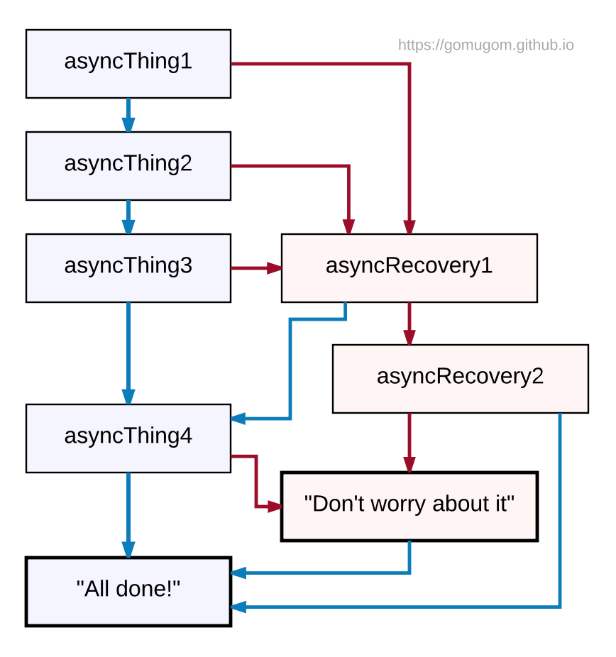

# CH 15. Promise - `by 재남`


## 15-1. 개요

서버통신, 시간지연 등 비동기 연산이 필요한 경우, 이를 콜백이 아닌 동기연산처럼 처리할 수 있게끔 해주는 명령어이다.

```js
const executer = (resolve, reject) => { ... };

new Promise(executer)
```

executer는 resolve, reject를 파라미터로 갖는 함수이며, `new Promise(executer)` 구문에 의해 즉시 실행된다.
이 함수 내에서 어떤 연산 이후 결과값을 반환하거나(resolve), `resolve()` 또는 `reject()` 함수를 호출하면 이는 곧 `thenable` 객체가 된다.
`thenable` 객체는 `then(onFulfilled, onRejected)` 또는 `catch(onRejected)` 메소드를 체이닝으로 연결할 수 있다.

예제를 통해 살펴보자.

```js
const promiseTest = param => new Promise((resolve, reject) => {
	setTimeout(() => {
		if (param) {
			resolve("해결 완료");
		} else {
			reject(Error("실패!!"));
		}
	}, 1000);
});

const testRun = param => promiseTest(param)
  .then(text => { console.log(text); })
  .catch(error => { console.error(error); });

// testRun(true);
// testRun(false);
```

`promiseTest` 함수는 param을 받아 executer가 즉시 실행된 상태의 [새로운 프라미스 객체]를 반환한다.
param에 `true`를 넘길 경우에는 1초 뒤 `resolve(...)`가 호출되고,
`false`를 넘길 경우에는 1초 뒤 `reject(...)`가 호출된다.

`resolve()`가 호출된 `thenable` 객체는 메소드 체이닝을 통해 `then(onFullfilled)`를 실행시키며,
`reject()`가 호출된 `thenable` 객체는 메소드 체이닝을 통해 `catch(onRejected)`를 실행시킨다.
즉 `then`, `catch`는 thenable 객체의 상태에 따라 실행되거나 무시된다.


## 15-2. 상태

Promise 객체의 상태는 다음 세가지 중 하나이다.
- 대기중(pending): 초기 상태, 이행 또는 거부되지 않은 상태.
- 처리됨(settled): 연산이 수행된 상태.
  + 이행됨(fulfilled): 연산이 성공리에 완료된 상태.
  + 거부됨(rejected): 연산이 실패한 상태.

위의 예제의 경우 executer가 실행된 이후 1초가 지나기 전까지의 상태는 `pending`상태이며,
이 때까지의 프라미스 객체는 `thenable`하지 않다. 1초가 경과된 시점에서 `settled` 상태,
그 중에서도 `fulfilled` 혹은 `rejected` 상태가 결정되며, 이에 따라 `then` 또는 `catch` 메소드가 실행된다.


## 15-3. 프라미스 체이닝

여러개의 asynchronous한 함수를 순차 호출하기 위해서, 기존에는 callback함수를 활용해왔다. promise에서도 이와 비슷한 방식으로 구현할 수 있다.

```js
const promiseFunc = param => new Promise((resolve, reject) => {
	if (param) resolve(param + 1);
	else reject(Error("실패!!"));
});
promiseFunc(1)
.then(result1 => {
	// result1 사용
	promiseFunc(result1)
	.then(result2 => {
		promiseFunc(result2)
		.then(result3 => {
			...
		});
	});
});
```

그런데 프라미스의 `then` 메소드는 언제나 프라미스를 반환한다. return한 값이 `[[PromiseValue]]`라는 프로퍼티에 담겨 전달되는 것이다. 심지어 return이 없을 경우에는 undefined가 담긴 프라미스를 반환한다. 이를 이용하면 위와 같이 depth가 무한정 깊어지는 _콜백지옥_ 형태를 피하고 flat한 구문을 유지할 수 있다.

```js
const promiseFunc = param => new Promise((resolve, reject) => {
	if (param) resolve(param + 1);
	else reject(Error("실패!!"));
});

promiseFunc(1)                    // promiseFunc 호출 [1]
.then(result1 => {
	// result1 사용
	return promiseFunc(result1);   // promiseFunc 호출 [2]
})
.then(result2 => {
	// result2 사용
	return promiseFunc(result2);   // promiseFunc 호출 [3]
})
.then(result3 => {
	// result3 사용
})
.catch(err => {
	// promiseFunc[1], promiseFunc[2], promiseFunc[3]중 어딘가에서 발생한 에러 핸들링
});
```

뿐만 아니라 ajax통신 등에서 json을 파싱하는 작업을 _자연스러운 흐름에 따라_ 기술할 수 있어, 코드 가독성이 높아지는 이익도 얻을 수 있다.

```js
fetch(url)
.then(res => JSON.parse(res))
.then(data => {
	// 파싱된 데이터 사용
});
```

위 내용의 일부를 미리 함수화해둔다면 반복을 상당히 줄일 수 있을 것이다.

```js
const getJSON = url => fetch(url).then(res => JSON.parse(res));

getJSON(url).then(data => {
	// 파싱된 데이터 사용
});
```


## 15-4. 에러 핸들링


프라미스 체이닝을 이용하면 단계별로 그룹화하여 에러핸들링을 처리할 수 있다.

```js
asyncThing1()
.then(()=> asyncThing2)
.then(()=> asyncThing3)
.catch(err => asyncRecovery1)
.then(
	()=> asyncThing4,
	err => asyncRecovery2
)
.catch(err => { console.log("Don't worry about it"); })
.then(() => { console.log("All done!"); });
```

[](https://developers.google.com/web/fundamentals/getting-started/primers/promises)
_파란선 : resolved // 빨간선 : reject_


`catch` 메소드는 명시적으로 reject한 경우뿐이 아니라, resolve할 대상 인자의 error에 대해서도 호출된다.

```js
new Promise((resolve, reject) => { reject('error!'); })
.then(res => {
	console.log(res); // 호출안됨
})
.catch(err => {
	console.error(err);
});

new Promise((resolve, reject) => { resolve(JSON.parse('')); })
.then(res => {
	console.log(res); // 호출안됨
})
.catch(err => {
	console.error(err);
});
```


## 15-5. 부분 또는 전체

### 15-5-1. `Promise.all(array of Promises)`

배열의 모든 요소가 fulfilled되면 마지막으로 fulfilled된 이후 then 구문을 진행한다. 반면 하나라도 rejected된다면 그 즉시 catch 구문이 진행된다.

배열의 각 요소는 `Promise.resolve`를 통과하므로, 반드시 프라미스로 이루어져 있어야할 필요는 없다.

fulfill시 then 구문으로 넘어오는 값은 각 요소의 fulfilled된 값으로 이루어진 배열이며, 원본 배열의 순서를 그대로 따른다. 한편 rejected된 경우 catch 구문으로 넘어오는 값은 처음 rejected된 값이다.

```js
const arr = [
	1,
	new Promise((resolve, reject) => {
		setTimeout(()=> {
			resolve('1000ms');
		}, 1000);
	}),
	'abc',
	()=> 'not called function',
	(()=> 'IIFE')()
];

Promise.all(arr)
.then(res => { console.log(res); })
.catch(err => { console.error(err); });

// [1, "1000ms", "abc", function, "IIFE"]
```

```js
const arr = [
	1,
	new Promise((resolve, reject) => {
		setTimeout(()=> {
			reject('rejected after 1000ms');
		}, 1000);
	}),
	'abc',
	()=> 'not called function',
	(()=> 'IIFE')()
];

Promise.all(arr)
.then(res => { console.log(res); })
.catch(err => { console.error(err); });

// rejected after 1000ms
```


### 15-5-2. `Promise.race(array o Promises)`

배열의 요소들 중 가장 먼저 fulfill되거나 reject되는 요소를 즉시 then 또는 catch구문의 값으로 전달한다. 마찬가지로 배열의 각 요소는 반드시 프라미스일 필요는 없다.

```js
const arr = [
	new Promise(resolve => {
		setTimeout(()=> { resolve('1번요소, 1000ms'); }, 1000);
	}),
	new Promise(resolve => {
		setTimeout(()=> { resolve('2번요소, 500ms'); }, 500);
	}),
	new Promise(resolve => {
		setTimeout(()=> { resolve('3번요소, 750ms'); }, 750);
	})
];
Promise.race(arr)
.then(res => { console.log(res); })
.catch(err => { console.error(err); });

// 2번요소, 500ms
```

```js
const arr = [
	new Promise(resolve => {
		setTimeout(()=> { resolve('1번요소, 0ms'); }, 0);
	}),
	'no queue'
];
Promise.race(arr)
.then(res => { console.log(res); })
.catch(err => { console.error(err); });

// no queue
```

```js
const arr = [
	new Promise(resolve => {
		setTimeout(()=> { resolve('1번요소, 0ms'); }, 0);
	}),
	Promise.reject('reject!')
];
Promise.race(arr)
.then(res => { console.log(res); })
.catch(err => { console.error(err); });

// reject!
```

Method | Description
---|---
Promise.resolve(promise) | promise를 반환한다 (promise.constructor === Promise인 경우에만).
Promise.resolve(thenable) | thenable로부터 새로운 promise를 생성한다.
Promise.resolve(obj) | obj를 fulfill하는 promise를 생성한다.
Promise.reject(obj) | obj를 reject하는 promise를 생성한다. **obj는 Error의 인스턴스여야만 한다.**
Promise.all(array) | 배열 각 요소가 모두 fulfill되면 then을, 하나라도 reject되면 catch를 따른다.
Promise.race(array) | 배열 요소들 중 가장 먼저 fulfill 또는 reject되는 대상의 promise를 진행한다.
